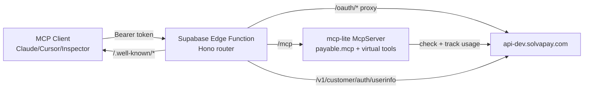

# Lovable MCP Server (preview)

Self-contained guide for wiring SolvaPay paywall + OAuth into a Lovable-built
MCP server. Assumes the Lovable default stack: Vite 5, React 18, TypeScript,
Supabase. The MCP server itself is a **Supabase Edge Function** running
`mcp-lite` on top of Hono. Pinned to the floating `@preview` tag and the dev
backend (`https://api-dev.solvapay.com`). Not for production.

## When to use this skill

Use when all three are true:

- The project is a Lovable app (Vite + React + TypeScript + Supabase).
- The goal is a **self-hosted** MCP server with paywalled tools that MCP
  clients (Claude Desktop, Cursor, Inspector) connect to over HTTP.
- OK running against SolvaPay sandbox and `api-dev.solvapay.com` during the
  preview window.

Do **not** use this skill if:

- You want SolvaPay to host the MCP server for you (no code, proxy-based) —
  use the `mcp-pay` route in the `solvapay` skill instead.
- You want to add a hosted checkout UI to a Lovable web app — use
  `lovable-checkout`.
- You are building an MCP App UI (iframe inside Claude Desktop or ChatGPT) —
  use `mcp-app-checkout`. The auth/iframe wiring is different.

## Guardrails

Explicit Never / Always for the Lovable agent to internalise before writing
code:

- **Never** put `SOLVAPAY_SECRET_KEY` in `.env`, `VITE_*`, `import.meta.env`,
  or any file the browser can reach. The secret lives **only** as a Supabase
  edge function secret (`supabase secrets set`).
- **Never** wrap virtual tool handlers (`get_user_info`, `upgrade`,
  `manage_account`) with `payable.mcp()` — they bypass the paywall by design
  and must stay that way.
- **Never** require auth on `/.well-known/*` or `/oauth/*` routes. DCR and
  the authorize/token exchange break if these return 401.
- **Never** re-parse and re-serialize the `/oauth/token` body. Forward the
  raw bytes with `await c.req.text()` — re-encoding (`+` vs `%20`, param
  ordering) can break PKCE verification and Basic-auth signatures.
- **Never** emit a discovery doc whose `issuer` doesn't match
  `MCP_PUBLIC_BASE_URL`. Strict MCP clients (current Cursor) reject RFC 8414
  §3.3 mismatches silently with "Transient error".
- **Never** mutate the `_auth` field from client-supplied tool arguments. It
  is server-injected by the mcp-lite middleware on every `tools/call`.
- **Never** hand-roll OAuth flows — SolvaPay's hosted `/v1/customer/auth/*`
  endpoints cover DCR, authorize, token, and userinfo.
- **Never** call `registerVirtualToolsMcp` from `@solvapay/server`. That
  helper targets the **official** `@modelcontextprotocol/sdk` `registerTool`
  signature, which `mcp-lite` does not provide. Use mcp-lite's native
  `server.tool(name, { inputSchema, handler })` shape described below.
- **Always** install with the `@preview` tag for every `@solvapay/*` package
  and pin `mcp-lite`, `hono`, and `zod` via Deno `npm:` specifiers in the
  function's import map.
- **Always** set `SOLVAPAY_API_BASE_URL=https://api-dev.solvapay.com` as a
  Supabase secret. Production rejects sandbox keys.
- **Always** resolve `customer_ref` in a mcp-lite middleware (`mcp.use(...)`)
  that runs **before** tool handlers — otherwise `payable.mcp` cannot gate.
- **Always** set `MCP_PUBLIC_BASE_URL` to the public origin **including the
  function path prefix**
  (`https://<project-ref>.supabase.co/functions/v1/mcp`). DCR-registered
  redirects break if this is missing.
- **Never** publish a Lovable project pinned to `@preview` — it tracks a
  moving build. Swap to a stable tag before going live (see Handoff).

## Architecture



One Supabase Edge Function. Hono routes split into four responsibilities:
discovery (unauthenticated `.well-known` JSON), OAuth proxy (`/oauth/*`
forwarding to SolvaPay with `product_ref` injected at DCR), MCP transport
(`/mcp` with bearer-token resolution), and nothing else. The function
presents itself as the authorization server (RFC 8414 §3.3 self-consistent
issuer) while SolvaPay's hosted backend still owns login, token issuance,
DCR storage, and userinfo.

## Prerequisites

- SolvaPay dev console access with a sandbox product and at least one plan.
- A sandbox secret key: `sp_sandbox_...`.
- The product ref: `prd_...`.
- Supabase CLI installed locally (`npm install -g supabase`) **or**
  willingness to create functions through the Supabase dashboard.
- A Supabase project already wired into the Lovable app (Lovable scaffolds
  this by default — `VITE_SUPABASE_URL` and `VITE_SUPABASE_ANON_KEY` exist
  in `.env`).

## Step 1 — Create the Edge Function and pin preview packages

From the project root:

```bash
supabase functions new mcp
```

Create `supabase/functions/mcp/deno.json` with the import map. Preview tags
for every SolvaPay package, explicit majors for the open-source deps:

```json
{
  "imports": {
    "mcp-lite": "npm:mcp-lite@^0.10.0",
    "hono": "npm:hono@^4",
    "zod": "npm:zod@^3",
    "@solvapay/server": "npm:@solvapay/server@preview",
    "@solvapay/auth": "npm:@solvapay/auth@preview",
    "@solvapay/core": "npm:@solvapay/core@preview"
  }
}
```

If a preview version is already pinned to an exact string, replace it with
`"@preview"` so the next deploy tracks the current build.

## Step 2 — Set Supabase secrets and deploy

```bash
supabase secrets set SOLVAPAY_SECRET_KEY=sp_sandbox_...
supabase secrets set SOLVAPAY_API_BASE_URL=https://api-dev.solvapay.com
supabase secrets set SOLVAPAY_PRODUCT_REF=prd_...
supabase secrets set MCP_PUBLIC_BASE_URL=https://<project-ref>.supabase.co/functions/v1/mcp
supabase functions deploy mcp
```

`MCP_PUBLIC_BASE_URL` **must** include the `/functions/v1/mcp` prefix —
DCR-registered redirects and the `resource` field in the protected-resource
document point at this origin. Redeploy after changing any secret; secrets
are baked into the function runtime at deploy time.

## Step 3 — The Edge Function entrypoint

Replace `supabase/functions/mcp/index.ts` with:

```ts
import { Hono } from 'hono'
import { McpServer, StreamableHttpTransport } from 'mcp-lite'
import { createSolvaPay, createSolvaPayClient } from '@solvapay/server'
import { z } from 'zod'

const apiBaseUrl = Deno.env.get('SOLVAPAY_API_BASE_URL') ?? 'https://api.solvapay.com'
const productRef = Deno.env.get('SOLVAPAY_PRODUCT_REF')!
const publicBaseUrl = Deno.env.get('MCP_PUBLIC_BASE_URL')!

const apiClient = createSolvaPayClient({
  apiKey: Deno.env.get('SOLVAPAY_SECRET_KEY')!,
  apiBaseUrl,
})

const solvaPay = createSolvaPay({ apiClient })
const payable = solvaPay.payable({ product: productRef })

const mcp = new McpServer({
  name: 'my-lovable-mcp',
  version: '0.1.0',
  schemaAdapter: schema => z.toJSONSchema(schema as z.ZodType),
})

const app = new Hono()
```

The rest of this file wires middleware, tools, well-known routes, and the
transport bind. Each step below appends to the same file.

## Step 4 — Resolve the bearer token and inject `_auth`

`payable.mcp`'s `getCustomerRef` reads `args._auth.customer_ref`. A mcp-lite
middleware runs **before** every tool handler, resolves the bearer token
against SolvaPay's userinfo endpoint, and injects `_auth` into `tools/call`
arguments. Append to `index.ts`:

```ts
async function resolveCustomerRef(authHeader: string | null): Promise<string | null> {
  if (!authHeader?.startsWith('Bearer ')) return null
  const response = await fetch(`${apiBaseUrl}/v1/customer/auth/userinfo`, {
    headers: { Authorization: authHeader },
  })
  if (!response.ok) return null
  const payload = (await response.json()) as {
    customerRef?: string
    customer_ref?: string
    sub?: string
  }
  return payload.customerRef ?? payload.customer_ref ?? payload.sub ?? null
}

mcp.use(async (ctx, next) => {
  const authHeader = ctx.request.headers?.get?.('Authorization') ?? null
  const customerRef = await resolveCustomerRef(authHeader)
  ctx.state.customerRef = customerRef

  if (ctx.request.method === 'tools/call' && ctx.request.params?.arguments) {
    ;(ctx.request.params.arguments as Record<string, unknown>)._auth = {
      customer_ref: customerRef,
    }
  }

  await next()
})

const getCustomerRef = (args: Record<string, unknown>): string => {
  const auth = args?._auth as { customer_ref?: string } | undefined
  return auth?.customer_ref || 'anonymous'
}
```

`ctx.state.customerRef` is available to any handler that wants it; `_auth`
is the channel `payable.mcp` already understands. Leaving `'anonymous'` as
the fallback lets `payable.mcp` return a paywall error with a checkout URL
instead of crashing for unauthenticated probes.

## Step 5 — Wrap paid tools with `payable.mcp`

Write business logic as plain async functions, wrap with `payable.mcp`, and
register with mcp-lite's native `server.tool`. Append to `index.ts`:

```ts
async function createTask(args: { title: string }) {
  return { success: true, task: { id: crypto.randomUUID(), title: args.title } }
}

mcp.tool('create_task', {
  description: 'Create a task',
  inputSchema: z.object({
    title: z.string(),
    _auth: z.any().optional(),
  }),
  handler: payable.mcp(createTask, { getCustomerRef }),
})
```

`payable.mcp` automatically:

- Checks usage/plan limits before running business logic.
- Tracks usage after a successful run.
- Wraps results in the MCP `content` envelope.
- Returns a structured paywall error (with checkout URL) on limit breach.

No manual `PaywallError` handling is needed. The `_auth` field is declared
as optional on the schema so MCP clients that don't send it still pass
validation — the middleware injects it regardless.

## Step 6 — Register virtual tools

Virtual tools are free, unmetered self-service tools. `solvaPay.getVirtualTools`
returns `get_user_info`, `upgrade`, and `manage_account` with handlers that
already know how to talk to SolvaPay. Register each one with mcp-lite's
`server.tool`:

```ts
const virtualTools = solvaPay.getVirtualTools({
  product: productRef,
  getCustomerRef,
})

for (const tool of virtualTools) {
  mcp.tool(tool.name, {
    description: tool.description,
    inputSchema: tool.inputSchema,
    handler: tool.handler,
  })
}
```

To exclude a specific virtual tool, pass `exclude: ['manage_account']` in
the options, or skip it inside the loop. Do **not** wrap any virtual
handler with `payable.mcp()` — they must bypass the paywall.

## Step 7 — Serve the OAuth discovery documents

MCP clients call these two unauthenticated URLs to discover DCR and the
authorization server. Both documents are **self-consistent** with the MCP
origin per RFC 8414 §3.3: `issuer` and every endpoint live on
`MCP_PUBLIC_BASE_URL`. Strict clients (current Cursor) reject mismatches
silently with "Transient error"; lax clients (Claude Desktop, older Cursor)
tolerate them, which is why a broken doc can look like it works.

Append to `index.ts`:

```ts
app.get('/.well-known/oauth-protected-resource', c =>
  c.json({
    resource: publicBaseUrl,
    authorization_servers: [publicBaseUrl],
    scopes_supported: ['openid', 'profile', 'email'],
  }),
)

app.get('/.well-known/oauth-authorization-server', c =>
  c.json({
    issuer: publicBaseUrl,
    authorization_endpoint: `${publicBaseUrl}/oauth/authorize`,
    token_endpoint: `${publicBaseUrl}/oauth/token`,
    registration_endpoint: `${publicBaseUrl}/oauth/register`,
    revocation_endpoint: `${publicBaseUrl}/oauth/revoke`,
    token_endpoint_auth_methods_supported: ['client_secret_basic', 'client_secret_post'],
    response_types_supported: ['code'],
    grant_types_supported: ['authorization_code', 'refresh_token'],
    scopes_supported: ['openid', 'profile', 'email'],
    code_challenge_methods_supported: ['S256'],
  }),
)
```

All four OAuth endpoints are local to the Edge Function and transparently
forward to SolvaPay — wire them in Step 8. Both documents are safe to serve
unauthenticated; no secret key is exposed in either.

## Step 8 — Proxy OAuth endpoints to SolvaPay

Four routes forward DCR, authorize, token, and revoke to SolvaPay's hosted
`/v1/customer/auth/*` endpoints. DCR is the only route that injects
`product_ref`; authorize/token/revoke resolve product context from the
registered `client_id` alone. CORS preflight is mirrored back for native
MCP client origins (`cursor://`, `vscode://`, `vscode-webview://`,
`claude://`) so Electron-based clients' DCR preflight succeeds.

Append to `index.ts`:

```ts
const NATIVE_CLIENT_ORIGIN = /^(cursor|vscode|vscode-webview|claude):\/\/.+$/

function corsHeaders(origin: string | null): Record<string, string> {
  if (!origin || !NATIVE_CLIENT_ORIGIN.test(origin)) return {}
  return { 'Access-Control-Allow-Origin': origin, Vary: 'Origin' }
}

app.options('/oauth/*', c => {
  const origin = c.req.header('Origin') ?? null
  return new Response(null, {
    status: 204,
    headers: {
      ...corsHeaders(origin),
      'Access-Control-Allow-Methods':
        `${c.req.header('Access-Control-Request-Method') ?? 'POST'}, OPTIONS`,
      'Access-Control-Allow-Headers':
        c.req.header('Access-Control-Request-Headers') ?? 'authorization, content-type',
      'Access-Control-Max-Age': '600',
    },
  })
})

app.post('/oauth/register', async c => {
  const body = await c.req.text()
  const upstream = await fetch(
    `${apiBaseUrl}/v1/customer/auth/register?product_ref=${encodeURIComponent(productRef)}`,
    { method: 'POST', headers: { 'content-type': 'application/json' }, body },
  )
  return new Response(await upstream.text(), {
    status: upstream.status,
    headers: {
      ...corsHeaders(c.req.header('Origin') ?? null),
      'content-type': upstream.headers.get('content-type') ?? 'application/json',
    },
  })
})

app.get('/oauth/authorize', c => {
  const qs = new URL(c.req.url).search
  return c.redirect(`${apiBaseUrl}/v1/customer/auth/authorize${qs}`, 302)
})

app.post('/oauth/token', async c => {
  const body = await c.req.text()
  const auth = c.req.header('authorization')
  const upstream = await fetch(`${apiBaseUrl}/v1/customer/auth/token`, {
    method: 'POST',
    headers: {
      'content-type': c.req.header('content-type') ?? 'application/x-www-form-urlencoded',
      ...(auth && { authorization: auth }),
    },
    body,
  })
  return new Response(await upstream.text(), {
    status: upstream.status,
    headers: {
      ...corsHeaders(c.req.header('Origin') ?? null),
      'content-type': upstream.headers.get('content-type') ?? 'application/json',
    },
  })
})

app.post('/oauth/revoke', async c => {
  const body = await c.req.text()
  const auth = c.req.header('authorization')
  const upstream = await fetch(`${apiBaseUrl}/v1/customer/auth/revoke`, {
    method: 'POST',
    headers: {
      'content-type': c.req.header('content-type') ?? 'application/x-www-form-urlencoded',
      ...(auth && { authorization: auth }),
    },
    body,
  })
  return new Response(null, {
    status: upstream.status,
    headers: corsHeaders(c.req.header('Origin') ?? null),
  })
})
```

`await c.req.text()` forwards the exact body bytes the client sent. Do
**not** call `c.req.parseBody()` on `/oauth/token` — re-encoding (`+` vs
`%20`, parameter ordering) can break PKCE verification and Basic-auth
signatures.

## Step 9 — Bind the transport and serve

Append the final block to `index.ts`:

```ts
const httpHandler = new StreamableHttpTransport().bind(mcp)

// Swallow OIDC discovery probes. Cursor tries OIDC before RFC 8414; without this
// explicit 404, Supabase Edge's catch-all can return a non-OIDC-compliant JSON
// blob that fails Cursor's Zod validator. We return 404 (rather than a full OIDC
// doc) because SolvaPay is an OAuth 2.0 authorization server, not an OpenID
// Provider — we don't issue id_tokens or expose a JWKS endpoint, and claiming
// we do would break strict OIDC clients later in the flow.
app.get(
  '/.well-known/openid-configuration',
  () => new Response(null, { status: 404 }),
)

// GET /mcp is Cursor's Streamable HTTP back-channel probe. mcp-lite is stateless
// and can't serve it; returning 400 lands Cursor's FSM in `failed` with
// "Failed to open SSE stream: Bad Request". 405 with `Allow` keeps Cursor connected.
app.get(
  '/mcp',
  () =>
    new Response(null, {
      status: 405,
      headers: { Allow: 'POST, OPTIONS' },
    }),
)

app.post('/mcp', async c => {
  const authHeader = c.req.header('Authorization')
  if (!authHeader?.startsWith('Bearer ')) {
    return new Response(null, {
      status: 401,
      headers: {
        'WWW-Authenticate': `Bearer resource_metadata="${publicBaseUrl}/.well-known/oauth-protected-resource"`,
      },
    })
  }
  return httpHandler(c.req.raw)
})

Deno.serve(app.fetch)
```

The 401 + `WWW-Authenticate` pattern is what tells the MCP client to walk
the protected-resource document and start the DCR + OAuth flow. Without it,
clients have no way to discover where to authenticate.

Redeploy:

```bash
supabase functions deploy mcp
```

## Environment variables

| Variable | Where | Notes |
| --- | --- | --- |
| `VITE_SUPABASE_URL` | `.env` (client) | Already set by Lovable. |
| `VITE_SUPABASE_ANON_KEY` | `.env` (client) | Already set by Lovable. |
| `SOLVAPAY_SECRET_KEY` | Supabase secret | **Never** in `.env` or client code. `sp_sandbox_...` during preview. |
| `SOLVAPAY_API_BASE_URL` | Supabase secret | `https://api-dev.solvapay.com` during preview. |
| `SOLVAPAY_PRODUCT_REF` | Supabase secret | `prd_...`. Used for paywall **and** DCR. |
| `MCP_PUBLIC_BASE_URL` | Supabase secret | `https://<project-ref>.supabase.co/functions/v1/mcp` — include the function path prefix. |

## Sandbox verification

1. `supabase functions deploy mcp` completes cleanly (no import-map errors).
2. `curl https://<project>.supabase.co/functions/v1/mcp/.well-known/oauth-protected-resource`
   returns JSON with `resource` matching `MCP_PUBLIC_BASE_URL`.
3. `curl https://<project>.supabase.co/functions/v1/mcp/.well-known/oauth-authorization-server`
   returns JSON where `issuer` and every endpoint URL start with
   `MCP_PUBLIC_BASE_URL` (not `api-dev.solvapay.com`).
4. `curl -X POST -H 'content-type: application/json' -d '{"client_name":"smoke","redirect_uris":["http://localhost:9999/cb"]}' https://<project>.supabase.co/functions/v1/mcp/oauth/register`
   returns 201 with a `client_id` — the DCR proxy is forwarding to SolvaPay.
5. `curl -i -X OPTIONS -H 'Origin: cursor://smoke' -H 'Access-Control-Request-Method: POST' https://<project>.supabase.co/functions/v1/mcp/oauth/register`
   returns 204 with `Access-Control-Allow-Origin: cursor://smoke` — the
   native-scheme preflight is mirrored.
6. `curl -X POST https://<project>.supabase.co/functions/v1/mcp/mcp`
   returns 401 with `WWW-Authenticate: Bearer resource_metadata=...`.
6b. `curl -i https://<project>.supabase.co/functions/v1/mcp/mcp`
    returns 405 with `Allow: POST, OPTIONS` — no SSE back-channel is offered.
6c. `curl -i https://<project>.supabase.co/functions/v1/mcp/.well-known/openid-configuration`
    returns 404 — OIDC Discovery is explicitly declined so clients fall back to RFC 8414.
7. Run the MCP Inspector:
   `npx @modelcontextprotocol/inspector https://<project>.supabase.co/functions/v1/mcp/mcp`.
   DCR registers the inspector; browser redirects to SolvaPay dev login.
8. After login, `tools/list` shows `create_task`, `get_user_info`,
   `upgrade`, `manage_account`.
9. Call `create_task` with `{ "title": "test" }` **without** a plan — the
   response is a structured paywall error containing a checkout URL.
10. Open the checkout URL, complete a sandbox purchase with card
    `4242 4242 4242 4242`, then call `create_task` again — it succeeds.
11. Call `upgrade` — it lists plans. Call `manage_account` — it returns a
    customer portal link. Call `get_user_info` — it returns profile +
    purchase status.
12. Connect Cursor to the MCP URL — it completes DCR + OAuth without a
    "Transient error" dialog.

## Troubleshooting

| Symptom | Cause | Fix |
| --- | --- | --- |
| `registerTool is not a function` | Used `registerVirtualToolsMcp` from `@solvapay/server` (targets official SDK, not mcp-lite) | Loop `solvaPay.getVirtualTools(...)` and call `mcp.tool(...)` directly per Step 6 |
| DCR fails with "resource mismatch" | `MCP_PUBLIC_BASE_URL` missing the `/functions/v1/mcp` prefix | Set it to the full public URL of the function, `supabase functions deploy mcp` |
| MCP client hangs at "authenticating" | `/mcp` returns 401 without `WWW-Authenticate` | Confirm the bearer-check block in Step 8 is in place and returns the header |
| `/.well-known/*` returns 401 | Added auth middleware to Hono at the app level instead of only to `/mcp` | Keep auth logic inside the `/mcp` handler; `.well-known` and `/oauth/*` routes must be open |
| Cursor connects then silently fails with "Transient error" | Discovery doc `issuer` doesn't match the metadata URL (RFC 8414 §3.3) | `issuer` and every endpoint in `/.well-known/oauth-authorization-server` must be on `MCP_PUBLIC_BASE_URL` — see Step 7 |
| DCR preflight blocked with CORS error in Cursor/VS Code/Claude | Missing `OPTIONS /oauth/*` handler or wildcard `*` origin instead of mirroring the native scheme | Add the `app.options('/oauth/*', ...)` block from Step 8; echo the requesting `Origin` back |
| `/oauth/token` returns 400 `invalid_grant` on an otherwise valid code | Body re-serialized before forwarding (re-encoded `+` → `%20`, param reorder) | Use `await c.req.text()` in the token route — do **not** call `c.req.parseBody()` |
| 402 with no checkout URL | Hitting prod with sandbox key | Set `SOLVAPAY_API_BASE_URL=https://api-dev.solvapay.com`, redeploy |
| Paid tool runs without a plan | `_auth` never injected because middleware registered after tool | `mcp.use(...)` must be called **before** any `mcp.tool(...)` registration |
| `anonymous` recorded as the customer on every call | Userinfo returning 401 — token stale or bearer passed verbatim without `Bearer ` prefix | Confirm MCP client negotiated a fresh token; `authHeader.startsWith('Bearer ')` check must pass |
| Deno resolves wrong versions on deploy | Missing or stale `supabase/functions/mcp/deno.json` | Recreate per Step 1, `supabase functions deploy mcp` |
| Virtual tool names clash with business tool names | Registered a business tool called `upgrade` | Rename your tool or exclude the virtual one via `getVirtualTools({ ..., exclude: ['upgrade'] })` |
| Cursor auth succeeds but FSM lands in `failed` with "Failed to open SSE stream: Bad Request" | mcp-lite's transport returns 400 on `GET /mcp`; Cursor's Streamable HTTP back-channel probe trips `transport_error` | Add the explicit `app.get('/mcp', ...)` 405 branch from Step 9 |
| Cursor logs Zod validation error on `jwks_uri` / `subject_types_supported` at first connect | Supabase Edge catch-all returned OAuth metadata for `/.well-known/openid-configuration`; Cursor's OIDC validator rejects it | Add `app.get('/.well-known/openid-configuration', ...)` returning 404 from Step 9 |

## Handoff — going stable

When `1.0.8` (or the next stable minor) promotes to `@latest`:

1. Replace every `@preview` pin in `supabase/functions/mcp/deno.json` with
   the stable version (e.g. `"npm:@solvapay/server@^1.0.8"`).
2. Rotate the Supabase secret `SOLVAPAY_API_BASE_URL` to
   `https://api.solvapay.com`.
3. Rotate `SOLVAPAY_SECRET_KEY` to a `sp_live_...` prod key.
4. Rotate `MCP_PUBLIC_BASE_URL` if you front the function with a custom
   domain; otherwise leave it.
5. `supabase functions deploy mcp`.
6. Retire this skill in favour of
   `solvapay/sdk-integration/mcp-server/guide.md` once the mcp-lite flavour
   lands on the stable skill.
